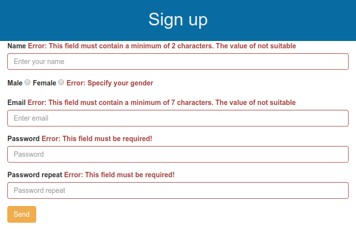

# MVP JS Form validation

- a simple implementation form validation of the pattern MVP in JavaScript
- use a simple server for nodejs. It generates a token which gives when asked to address "/login" or "/auth". when posting back to the server at "/api/verify" is checked token and data is returned to the client. 
- The token is sent through the header "x-access-token" to the server along with the data request 
- all packages must be installed before running "npm i" 
- after starting the server "npm run start" you can go to the address in the browser http://localhost:3000/

	

